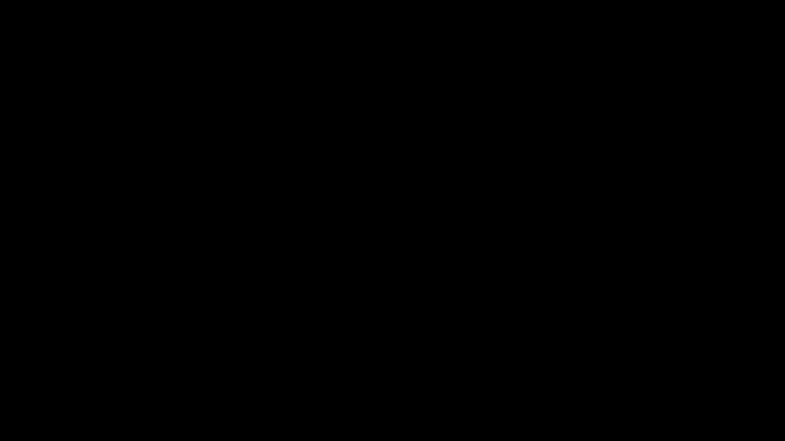

## 基于强化学习训练贪吃蛇

自己通过AI老师慢慢学,慢慢改的

### 未开始训练时的游戏

`uv run snake/run.py`



#### 第一次开始训练时的模型

只会上下走,维持不死

```python
reward = 0
if self.game_over:
    reward = -1  # 撞墙或撞自己，负奖励
elif self.snake[0] == self.food:
    reward = 1  # 吃到食物，正奖励
else:
    reward = -0.01  # 每步小负奖励，鼓励快速吃到食物
return self.get_state(), reward, self.game_over
```


### install

```shell
uv init
uv venv
source .venv/bin/activate
# win
Set-ExecutionPolicy -ExecutionPolicy RemoteSigned -Scope Process
.venv/Scripts/activate

uv pip install .
```
