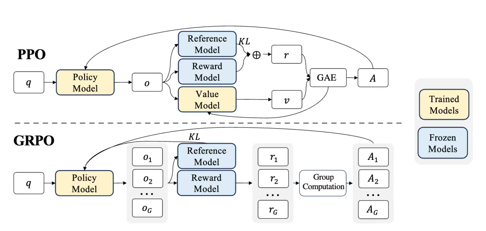

## RL

```
REINFORCE (1992) → Actor-Critic → A2C (2016) → A3C (2016) → PPO (2017) → GRPO → GSPO
                ↘ DQN (2013/2015) [基于价值的分支]
```


>##### 简单RL示例场景：CartPole
>* **目标**：控制一辆小车左右移动，来让车上的杆子保持竖直不倒。
>* **状态 (State)**：一个包含4个数字的向量，分别代表 [小车位置, 小车速度, 杆子角度, 杆子顶端速度]。
>* **动作 (Action)**：2个离散动作，`0` 代表向左推小车，`1` 代表向右推小车。
>* **奖励 (Reward)**：只要杆子还没倒下，每经过一个时间步，就获得 `+1` 的奖励。
>* **结束条件**：杆子倾斜超过一定角度，或者小车移动到屏幕边缘，一局游戏（episode）就结束了。

### REINFORCE
通常称其为**蒙特卡洛策略梯度** (Monte Carlo Policy Gradient)

核心思想： 一个动作的好坏，应该由它最终带来的整个回报 (Return) 来评价。如果一个动作序列最终获得了很高的回报，那么我们就应该让我们策略网络，增大产生这个序列中每一个动作的概率。反之，如果回报很低，就降低它们的概率。

1.  初始化一个策略网络 $\pi_\theta(a|s)$，它输入状态 `s`，输出一个动作 `a` 的概率分布。
2.  用当前的策略网络 $\pi_\theta$ 与环境交互，从头到尾完整地玩一局（或多局），并**记录下整个轨迹** (trajectory)：$\tau = (s_0, a_0, r_1, s_1, a_1, r_2, \dots, s_T, a_T, r_{T+1})$。
3.  对于轨迹中的**每一个时间步** `t`，计算从该时刻开始，到游戏结束的**未来总回报** $G_t$。
    $$G_t = R_{t+1} + \gamma R_{t+2} + \dots + \gamma^{T-t} R_{T+1}$$
目标是最大化一个策略的期望回报。这个期望回报通常用 $J(\theta)$ 来表示，它可以是多种形式，但最常见的是从初始状态 $s_0$ 开始的期望回报：
$$J(\theta) = \mathbb{E}_{s_0 \sim \rho_0, a_t \sim \pi_\theta, s_{t+1} \sim p} [G_0]$$
这里的 $G_0$ 是从 $s_0$ 开始的总回报。为了最大化 $J(\theta)$，我们需要计算它的梯度 $\nabla_\theta J(\theta)$

4.  **策略梯度定理**: 策略的梯度可以表示为一个期望。这个期望的计算方式是：沿着一条轨迹 $\tau$，对每个时间步 $t$，将**策略在该时间步的对数概率梯度** $\nabla_\theta \log \pi_\theta(a_t|s_t)$ 乘以**从该时间步开始的未来总回报** $G_t$。，并使用梯度上升来更新策略网络的参数 $\theta$。
    $$\nabla_\theta J(\theta) = \mathbb{E}_{\tau \sim \pi_\theta} \left[ \sum_{t=0}^{T} G_t \nabla_\theta \log \pi_\theta(a_t|s_t) \right]$$

    在很多实现中，我们会对回报 $G_t$ 进行标准化，或者减去一个基线 (Baseline)，比如状态价值 $V(s_t)$。这可以显著降低方差。所以更通用的形式是：
    $$\nabla_\theta J(\theta) = \mathbb{E}_{\tau \sim \pi_\theta} \left[ \sum_{t=0}^{T} (G_t - b(s_t)) \nabla_\theta \log \pi_\theta(a_t|s_t) \right]$$
      * **$\log \pi_\theta(a_t|s_t)$**：这是我们实际采取的动作 $a_t$ 的对数概率。它的梯度 $\nabla_\theta \log \pi_\theta(a_t|s_t)$ 指明了参数更新的方向，这个方向可以**最大程度地提升** $a_t$ 的概率。
      * **$G_t$**：这就是我们计算出的未来总回报。它在这里扮演了**权重**的角色。
          * 如果 $G_t$ 是一个很大的正数，意味着从 $(s_t, a_t)$ 出发得到了好结果，那么我们就用一个大的权重去增强 $\log \pi_\theta(a_t|s_t)$ 的梯度，让策略更倾向于在 $s_t$ 选择 $a_t$。
          * 如果 $G_t$ 是一个负数或很小的正数，意味着结果不好，我们就会用一个小的甚至负的权重，让策略减少在 $s_t$ 选择 $a_t$ 的倾向。

5. **推导**

- **期望到积分**：我们将期望写成对所有可能轨迹 $\tau$ 的积分形式：
    $$
    J(\theta) = \sum_{\tau} P(\tau; \theta) G(\tau)
    $$
    其中 $P(\tau; \theta)$ 是在策略 $\pi_\theta$ 下产生轨迹 $\tau$ 的概率，$G(\tau)$ 是这条轨迹的总回报。
- **对数导数技巧**（Log-derivative Trick）：这是一个非常关键的数学技巧。我们知道：
    $$
    \nabla_\theta P(\tau; \theta) = P(\tau; \theta) \frac{\nabla_\theta P(\tau; \theta)}{P(\tau; \theta)} = P(\tau; \theta) \nabla_\theta \log P(\tau; \theta)
    $$
    
- **轨迹概率展开**：一条轨迹 $\tau = (s_0, a_0, \dots, s_T, a_T)$ 出现的概率，是由策略和环境的动态共同决定的：
    $$
    P(\tau; \theta) = p(s_0) \prod_{t=0}^{T} \pi_\theta(a_t|s_t) p(s_{t+1}|s_t, a_t)
    $$
    因此，它的对数概率是：
    $$
    \log P(\tau; \theta) = \log p(s_0) + \sum_{t=0}^{T} \log \pi_\theta(a_t|s_t) + \sum_{t=0}^{T} \log p(s_{t+1}|s_t, a_t)
    $$
- **求梯度**：现在我们对 $\log P(\tau; \theta)$ 求关于 $\theta$ 的梯度。因为环境的动态 $p(\dots)$ 不依赖于我们的策略参数 $\theta$，所以它们的梯度为零。
    $$
    \nabla_\theta \log P(\tau; \theta) = \sum_{t=0}^{T} \nabla_\theta \log \pi_\theta(a_t|s_t)
    $$
    这个结果非常重要，它表明**轨迹概率的梯度，等于轨迹中所有动作对数概率梯度的和**。
- **代入并整理**：我们将以上结果代回梯度公式中：
    $$
    \nabla_\theta J(\theta) = \nabla_\theta \sum_{\tau} P(\tau; \theta) G(\tau) = \sum_{\tau} G(\tau) \nabla_\theta P(\tau; \theta)
    $$
    应用对数导数技巧：
    $$
    = \sum_{\tau} G(\tau) P(\tau; \theta) \nabla_\theta \log P(\tau; \theta)
    $$
    代入上一步的求和结果：
    $$
    = \sum_{\tau} G(\tau) P(\tau; \theta) \left( \sum_{t=0}^{T} \nabla_\theta \log \pi_\theta(a_t|s_t) \right)
    $$
    最后，我们将求和 $\sum_{\tau} P(\tau; \theta) \dots$ 转换回期望 $\mathbb{E}_{\tau \sim \pi_\theta}[\dots]$ 的形式，就得到了最终的公式 其中，蒙特卡洛策略梯度使用从**当前时间步**开始的未来回报 $G_t$ 来代替了整个轨迹的回报 $G(\tau)$，所以最终的公式是：
    $$
    \nabla_\theta J(\theta) = \mathbb{E}_{\tau \sim \pi_\theta} \left[ \sum_{t=0}^{T} G_t \nabla_\theta \log \pi_\theta(a_t|s_t) \right]
    $$
这个公式的含义非常直观：它通过对**完整轨迹**的采样来**估计**策略梯度。如果在某个状态 $s_t$ 下采取了动作 $a_t$ 并最终获得了高回报 $G_t > 0$，那么我们就增大 $\log \pi_\theta(a_t|s_t)$ 的梯度，从而提高这个动作的概率。反之，如果回报低 ($G_t < 0$)，就降低这个动作的概率。这就是**蒙特卡洛策略梯度**的核心思想。

### 从 REINFORCE 到 Actor-Critic

A-C核心思想是：**不再使用完整但充满噪声的 $G_t$，而是引入一个“评论家(Critic)”来提供一个更稳定、更及时的反馈信号。**

REINFORCE 的两个核心问题：

1.  **高方差 (High Variance)**：使用完整的未来总回报 $G_t$ 作为更新权重，这个值非常不稳定、充满噪声。就像打靶，虽然平均方向是对的，但每一枪都可能偏得很远。
2.  **更新效率低 (Low Efficiency)**：必须等一整局游戏结束后，才能开始学习。如果游戏一局要玩很久，那智能体就要“憋”很久才能学一次。

#### 引入“评论家”来解决问题

**1. 解决“高方差”问题：用优势函数替代总回报**

REINFORCE 用 $G_t$ 来评价动作 $a_t$ 的好坏。但 $G_t$ 的好坏，很大程度上取决于你所在的状态 $s_t$ 本身有多好。比如在 CartPole 里，杆子快倒了（坏状态），就算你做出最优动作，最终的总回报可能还是很低。

我们需要一个更公平的评价标准：**在当前状态 $s_t$ 下，我采取的动作 $a_t$ 究竟是比平均水平好，还是差？**

这就是 **优势函数 (Advantage Function) $A(s, a)$** 的概念。
$$A(s, a) = Q(s, a) - V(s)$$

  * $V(s)$ (状态价值)：代表在状态 $s$ 的“平均”价值。
  * $Q(s, a)$ (状态-动作价值)：代表在状态 $s$ 采取特定动作 $a$ 后的价值。
  * $A(s, a)$ (优势值)：衡量动作 $a$ 相对于该状态下平均动作的“优势”。
      * 如果 $A(s,a) > 0$，说明动作 $a$ 比平均水平好，值得鼓励。
      * 如果 $A(s,a) < 0$，说明动作 $a$ 比平均水平差，需要抑制。

这个优势值 $A$ 是一个比 $G_t$ 更稳定、更有效的学习信号。

**2. 解决“更新效率”问题：使用时序差分 (TD) 进行单步更新**

我们怎么得到优势函数 $A(s, a)$ 呢？我们需要 $Q$ 值和 $V$ 值。这时，“评论家(Critic)”就登场了。

  * **评论家 (Critic)**：一个独立的神经网络，它的唯一任务就是学习状态价值函数 $V(s)$。它会看着“演员(Actor)”的表演，并对演员所处的每一个状态打分。

有了 Critic 给出的 $V(s)$，我们可以用**时序差分误差 (TD Error)** 来近似优势函数 $A(s_t, a_t)$：
$$\text{TD Error} = \delta_t = \underbrace{(R_{t+1} + \gamma V(S_{t+1}))}_{\text{TD Target (更准确的V值估计)}} - \underbrace{V(S_t)}_{\text{Critic当前的V值估计}}$$
这个 TD Error 恰好就是优势函数的一个很好的估计！它只依赖于**下一步**的信息 ($R_{t+1}, S_{t+1}$)，而不需要等到游戏结束。

这使得智能体**每走一步就可以学习一次**，极大地提高了学习效率。

#### 演员 (Actor) 和 评论家 (Critic) 的分工

现在我们的框架里有了两个角色：

  * **演员 (Actor)**：就是我们之前的策略网络 $\pi_\theta(a|s)$。它负责根据状态**做出动作决策**。它不再听从 $G_t$ 的指导，而是听从 Critic 算出的优势信号 $\delta_t$。

      * **Actor 的更新目标**：最大化 $\log\pi_\theta(a_t|s_t) \times \delta_t$。

  * **评论家 (Critic)**：一个价值网络 $V_\phi(s)$。它负责**评价状态的好坏**，并为 Actor 提供更精确的指导信号 $\delta_t$。它通过最小化 TD Error 来学习，让自己的价值判断越来越准。

      * **Critic 的更新目标**：最小化 $( (R_{t+1} + \gamma V_\phi(S_{t+1})) - V_\phi(S_t) )^2$。

两者相互协作，共同进步。演员努力做出更好的动作，评论家努力做出更准的评价。


### 从 Actor-Critic 到 A2C

当前的 Actor-Critic 是**单步更新**的，即每与环境交互一步，就计算一次损失并更新网络。这虽然比 REINFORCE 高效，但单步的 TD-Error 依然存在一定的噪声。A2C 通过引入两个关键改进来提升性能和稳定性

#### 改进1：N-step 更新 (N-step Updates)

  * **思想**: 不再只看下一步，而是向前看 N 步，然后用 Critic 对第 N+1 步的状态进行价值估计。这在“高效率”（不需要等整个 episode）和“低方差”（N步回报比单步回报更准确）之间取得了更好的平衡。

  * **N-step 回报 (Return)**:
    $$G_{t:t+N} = R_{t+1} + \gamma R_{t+2} + \dots + \gamma^{N-1}R_{t+N} + \gamma^N V_\phi(S_{t+N})$$
    这里的 $V_\phi(S_{t+N})$ 是由 Critic 网络提供的。

#### 改进2：加入熵正则化 (Entropy Regularization)

  * **思想**: 在 Actor 的损失函数中，加入一项策略的“熵”（Entropy）。熵衡量了策略输出的随机性。鼓励更高的熵，就是鼓励智能体进行更多的**探索 (Exploration)**，避免它过早地收敛到一个次优策略（比如在 CartPole 里只会往一个方向推）。

  * **新的 Actor Loss**:
    $$L_{\text{actor}} = - \mathbb{E} [\log\pi_\theta(a_t|s_t) A_t] - \beta \cdot H(\pi_\theta(s_t))$$
    其中 $H(\pi_\theta(s_t))$ 是策略在状态 $s_t$ 的熵，$\beta$ 是一个控制熵奖励大小的超参数。

### 从 A2C 到 PPO


**Proximal Policy Optimization**（近端策略优化）

PPO的核心思想是在更新策略时，既要最大化期望回报，又不能让新策略偏离旧策略太远。

使用**剪切概率比**（Clipped Surrogate Objective）来更新策略。它的目标函数可以表示为：
$$
L(\theta) = \mathbb{E}_t \left[ \min \left( r_t(\theta) \hat{A}_t, \text{clip}(r_t(\theta), 1-\epsilon, 1+\epsilon) \hat{A}_t \right) \right]
$$
其中：
- $\theta$：策略网络的参数。
- $r_t(\theta) = \frac{\pi_\theta(a_t|s_t)}{\pi_{\theta_{\text{old}}}(a_t|s_t)}$：新旧策略的概率比。
- $\hat{A}_t$：优势函数，衡量动作的相对好坏。
- $\epsilon$：剪切参数（通常为 0.1 或 0.2），限制策略更新的幅度。
- $\text{clip}(x, a, b)$：将 $x$ 限制在 $[a, b]$ 范围内。



#### 图片解释

##### **(1) Policy Model（策略模型）**
- **作用**：根据当前状态 $ q $ 生成动作分布，指导智能体在环境中采取行动。
- **输入**：环境状态 $ q $。
- **输出**：动作概率分布 $ \pi(a|q) $，用于选择动作。
- **更新目标**：通过优化策略参数，使得策略能够产生更高的期望奖励。

##### **(2) Value Model（价值模型）**
- **作用**：估计当前状态的价值 $ v $，即从当前状态开始，按照当前策略执行所能获得的未来累计奖励的期望值。
- **输入**：环境状态 $ q $。
- **输出**：状态价值 $ v(q) $。
- **更新目标**：通过最小化价值估计与真实回报之间的误差，提高价值函数的准确性。

##### **(3) Reward Model（奖励模型）**
- **作用**：计算或预测当前状态下的即时奖励 $ r $。
- **输入**：环境状态 $ q $ 或其他相关信息。
- **输出**：即时奖励 $ r $。
- **更新目标**：准确评估当前状态或动作的即时奖励，为策略优化提供反馈。

##### **(4) Reference Model（参考模型）**
- **作用**：保存上一轮迭代的策略模型参数，用于计算新策略与旧策略之间的 KL 散度，确保策略更新的幅度可控。
- **输入**：上一轮的策略模型参数。
- **输出**：KL 散度 $ KL $，衡量新旧策略之间的差异。
- **更新目标**：通过 KL 散度约束，防止策略更新过大，避免性能崩溃。

##### **(5) GAE（Generalized Advantage Estimation）**
- **作用**：计算优势函数（Advantage Function），用于评估动作相对于基准的表现。
- **输入**：即时奖励 $ r $、状态价值 $ v $ 和超参数（如折扣因子 $ \gamma $ 和衰减因子 $ \lambda $）。
- **输出**：优势值 $ A $，表示采取某个动作比平均表现更好的程度。
- **更新目标**：通过优势值指导策略更新，使策略倾向于选择更有利的动作。

#### 执行步骤

##### **(1) 策略执行与数据收集**
- 策略模型 $ \pi(a|q) $ 根据当前状态 $ q $ 生成动作分布，并从中采样动作。
- 智能体在环境中执行动作，收集状态 $ q $、动作 $ a $、即时奖励 $ r $ 和下一个状态 $ q' $ 等信息。

##### **(2) 奖励与价值估计**
- **Reward Model** 计算即时奖励 $ r $。
- **Value Model** 估计当前状态的价值 $ v(q) $ 和下一个状态的价值 $ v(q') $。

##### **(3) 优势函数计算**
- 使用 GAE 方法计算优势值 $ A $：
  $$
  A_t = \delta_t + \gamma \lambda \delta_{t+1} + (\gamma \lambda)^2 \delta_{t+2} + \cdots
  $$
  其中：
  $$
  \delta_t = r_t + \gamma v(s_{t+1}) - v(s_t)
  $$
  这里 $ \gamma $ 是折扣因子，$ \lambda $ 是衰减因子。

##### **(4) 策略更新**
- **KL 散度约束**：计算新策略与旧策略之间的 KL 散度 $ KL $，确保策略更新的幅度不超过预设阈值。
- **目标函数优化**：最大化以下目标函数：
  $$
  L^{CLIP}(\theta) = \mathbb{E} \left[ \min \left( r_t(\theta) A_t, \text{clip}(r_t(\theta), 1-\epsilon, 1+\epsilon) A_t \right) \right]
  $$
  其中：
  $$
  r_t(\theta) = \frac{\pi_\theta(a_t|s_t)}{\pi_{\theta_{\text{old}}}(a_t|s_t)}
  $$
  表示新旧策略的概率比。

##### **(5) 价值函数更新**
- 更新价值模型，最小化价值估计与真实回报之间的均方误差：
  $$
  L^V(\theta_v) = \mathbb{E} \left[ (v_\theta(s_t) - R_t)^2 \right]
  $$
  其中 $ R_t $ 是使用 GAE 计算的蒙特卡洛回报。

### 从 PPO 到 GRPO

cc
### 从 GRPO 到 GSPO

ff

---

### 相关定义

#### **贝尔曼公式**

当前状态（或状态-动作对）的值等于即时奖励加上未来值的折扣期望。
- 基于Q函数（动作值函数），考虑状态-动作对的值，适用于需要显式选择动作的场景（如Q-learning）
$$
Q(s, a) = E[R_{t+1} + \gamma Q(S_{t+1}, A_{t+1}) | S_t = s, A_t = a]
$$
- 基于V函数（状态值函数），只关注状态的值，适用于策略评估或值迭代。
$$
V(i, j) \leftarrow R(i, j, \pi(i, j)) + \gamma V(\text{next\_state}(i, j, \pi(i, j)))
$$

#### **回报 (Return)**
   
**回报 (Return, $G_t$)**: 从时间步 $t$ 开始，未来所有奖励的折扣总和。它代表了从当前时刻开始，在一个具体的轨迹（episode）中，我们**实际**能获得的总收益。
    $$G_t = R_{t+1} + \gamma R_{t+2} + \gamma^2 R_{t+3} + \dots = \sum_{k=0}^{\infty} \gamma^k R_{t+k+1}$$
    其中 $R_{t+1}$ 是在 $t+1$ 时刻获得的即时奖励，$\gamma$ 是折扣因子。

#### **V值 (State-Value Function, $V(s)$)**

**直观理解：** 状态 $s$ 有多好？

**定义：** V值，即状态价值函数 $V_\pi(s)$，衡量的是当Agent从状态 $s$ 出发，并**遵循策略 $\pi$** 进行决策时，它所能获得的**期望回报**。
$$V_\pi(s) = \mathbb{E}_\pi[G_t | S_t = s]$$


这个公式回答的问题是：“如果我现在处于状态 $s$，并且我接下来的所有行为都遵循我的策略 $\pi$，那么平均下来我能得到多少总回报？”
在PPO算法中，**Critic网络** 的职责就是学习并估计这个 $V(s)$。给定一个状态，Critic会输出一个数值，这个数值就是对该状态价值的估计。

#### **Q值 (Action-Value Function, $Q(s, a)$)**

**直观理解：** 在状态 $s$ 下，执行动作 $a$ 有多好?

**定义：** Q值，即动作价值函数 $Q_\pi(s, a)$，衡量的是当Agent在状态 $s$ **选择了特定的动作 $a$**，然后**在后续所有步骤中遵循策略 $\pi$** 时，它所能获得的**期望回报**。
$$Q_\pi(s, a) = \mathbb{E}_\pi[G_t | S_t = s, A_t = a]$$

这个公式回答的问题是：“如果我现在处于状态 $s$，并且我**强制**执行动作 $a$，之后再让我的策略 $\pi$ 接管，那么平均下来我能得到多少总回报？”

#### **时序差分(Temporal-Difference, TD)**

利用当前对未来的估计，来更新更早的估计

* **时序（Temporal）：** 指的是学习过程是按时间顺序（$t, t+1, t+2, \dots$）发生的。
* **差分（Difference）：** 指的是学习的信号来自于两个估计值之间的**差异**。

TD误差是在时间步 $t$ 产生的一个信号，它衡量了我们**当前的价值估计**与**基于下一步实际情况的、更优的价值估计**之间的差距。

1.  **我们已有的估计：** 在 $t$ 时刻，我们处于状态 $S_t$。我们的`Critic`网络给出了对这个状态的价值估计：$V(S_t)$。这是我们的“旧知识”。

2.  **我们新的、更可靠的估计 (TD目标)：** 接着，我们执行动作 $A_t$，环境给了我们两个新的信息：
    * 一个即时奖励 $R_{t+1}$。
    * 一个新的状态 $S_{t+1}$。

    利用这些新信息，我们可以构建一个对 $V(S_t)$ 的**新目标值**，称为 **TD目标（TD Target）**：
    $$
    \text{TD Target} = R_{t+1} + \gamma V(S_{t+1})
    $$
    * 这个目标值的含义是：状态 $S_t$ 的价值，应该约等于我们马上得到的**真实奖励**，再加上我们对**下一个状态价值的估计**（折扣后）
    * 相比于单纯的 $V(S_t)$，TD目标包含了**一步的真实世界信息**（$R_{t+1}$），因此它通常是对 $V(S_t)$ 更准确、更可靠的一个估计。

3.  **计算误差：** TD误差就是“新估计”与“旧估计”之间的差值。
    $$
    \delta_t = \underbrace{(R_{t+1} + \gamma V(S_{t+1}))}_{\text{TD Target (新估计)}} - \underbrace{V(S_t)}_{\text{旧估计}}
    $$


#### **优势函数 (Advantage Function)**

优势函数衡量在状态 $s$ 采取动作 $a$ 比平均水平好多少。
$$A(s, a) = Q(s, a) - V(s)$$在实践中，我们无法得到真实的Q值和V值，所以我们用估计值。一个简单的方法是：$$\hat{A}_t = R_{t+1} + \gamma V(S_{t+1}) - V(S_t)$$
这里 $R_{t+1} + \gamma V(S_{t+1})$ 是对 $Q(S_t, A_t)$ 的估计。

更常用的是 **GAE (Generalized Advantage Estimation)**，它通过引入参数 $\lambda$ 来权衡偏差和方差，效果更好：
$$\hat{A}_t^{GAE}(\gamma, \lambda) = \sum_{l=0}^{\infty}(\gamma\lambda)^l \delta_{t+l}$$
其中 $\delta_{t+l} = r_{t+l} + \gamma V(s_{t+l+1}) - V(s_{t+l})$ 是时序差分误差 (TD Error)。

#### **Actor 损失 (Clipped Surrogate Objective)**

这是PPO的灵魂。我们定义策略概率比率 $r_t(\theta) = \frac{\pi_\theta(a_t|s_t)}{\pi_{\theta_{old}}(a_t|s_t)}$，其中 $\pi_{\theta_{old}}$ 是收集数据时的旧策略。

Actor的目标函数是：
$$L^{CLIP}(\theta) = \hat{\mathbb{E}}_t \left[ \min\left( r_t(\theta) \hat{A}_t, \quad \text{clip}(r_t(\theta), 1-\epsilon, 1+\epsilon) \hat{A}_t \right) \right]$$

  * $\hat{\mathbb{E}}_t$ 表示在所有时间步上取平均。
  * $\hat{A}_t$ 是我们计算好的优势函数。
  * **第一部分 $r_t(\theta) \hat{A}_t$：** 这是标准的策略梯度目标。如果优势 $\hat{A}_t$ 是正的，我们想增大 $r_t(\theta)$（即增大采取该动作的概率）；如果优势是负的，我们想减小它。
  * **第二部分 $\text{clip}(r_t(\theta), 1-\epsilon, 1+\epsilon) \hat{A}_t$：** 这是PPO的创新。`clip` 函数将比率 $r_t(\theta)$ 强制限制在 $[1-\epsilon, 1+\epsilon]$ 的范围内（通常 $\epsilon=0.2$）。
      * 这个限制意味着，即使某个动作的优势特别大，我们也不会让策略的更新幅度过大（被 $1+\epsilon$ 卡住）。
      * 同理，即使优势特别小，我们也不会让策略的惩罚过猛（被 $1-\epsilon$ 卡住）。
  * **$\min(\dots)$：** 我们取这两项中较小的一个作为最终的目标。这形成了一个“悲观”的下界，确保了更新的保守性和稳定性。

#### **Critic 损失**

这个很简单，就是价值网络预测值 $V_\phi(s_t)$ 和我们计算出的价值目标（也叫`Returns`）$V_{target}$ 之间的均方误差。
$$L^{VF}(\phi) = \left( V_\phi(s_t) - V_{target} \right)^2$$
其中 $V_{target}$ 通常是 $R_{t} + \gamma V_{target}(s_{t+1})$。


#### **GAE的直观解释：一个聪明的加权平均**

Generalized Advantage Estimation

GAE的核心公式是：
$$\hat{A}_t^{GAE}(\gamma, \lambda) = \sum_{l=0}^{\infty}(\gamma\lambda)^l \delta_{t+l}$$

让我们把这个求和展开来看：
$$\hat{A}_t^{GAE} = \delta_t + (\gamma\lambda)\delta_{t+1} + (\gamma\lambda)^2\delta_{t+2} + (\gamma\lambda)^3\delta_{t+3} + \dots$$
其中 $\delta_{t+l} = R_{t+l+1} + \gamma V(S_{t+l+1}) - V(S_{t+l})$ 是在未来第 $l$ 步的TD误差。

这个公式实际上是在说：
在 $t$ 时刻的优势，是**当前TD误差 $\delta_t$**，加上**折扣后的未来第一步的TD误差 $(\gamma\lambda)\delta_{t+1}$**，再加上**更深度折扣后的未来第二步的TD误差 $(\gamma\lambda)^2\delta_{t+2}$**，以此类推。

它是一个对未来所有TD误差的**指数加权移动平均**。

##### 参数 $\lambda$ 的魔力：偏差-方差的“调谐旋钮”

参数 $\lambda$（取值范围[0, 1]）控制了这个加权平均的权重衰减速度，从而让我们能够在偏差和方差之间自由调节。

* **当 $\lambda=0$ 时：**
    公式变为 $\hat{A}_t^{GAE} = \delta_t + 0 + 0 + \dots = \delta_t$。
    这**完全等同于单步TD估计**。我们得到了一个**高偏差、低方差**的估计。我们只相信一步之内的信息。

* **当 $\lambda=1$ 时：**
    公式变为 $\hat{A}_t^{GAE} = \sum_{l=0}^{\infty}(\gamma)^l \delta_{t+l}$。
    经过数学推导可以证明，这种情况**完全等同于蒙特卡洛估计** $G_t - V(S_t)$。
    我们得到了一个**低偏差、高方差**的估计。我们相信直到回合结束的整个轨迹。

* **当 $0 < \lambda < 1$ 时（例如，常用的 $\lambda=0.95$）：**
    这就是GAE的精髓所在。我们得到了一个**折衷方案**。
    * 我们给最近的TD误差 $\delta_t$ 最高的权重。
    * 我们也会考虑未来的TD误差 $\delta_{t+1}, \delta_{t+2}, \dots$，但它们的权重会随着 $(\gamma\lambda)$ 的幂次快速衰减。
    * 这相当于说：“我主要相信我的一步估计，但为了减少它的偏差，我也会参考一下未来几步的情况，不过未来的信息越远，我就越不信任它。”

**总结：** GAE通过引入参数 $\lambda$ ，巧妙地将高偏差低方差的TD估计和低偏差高方差的蒙特卡洛估计融合在了一起。它允许我们通过调整 $\lambda$ 来控制我们愿意接受多少偏差和多少方差，从而在实践中获得更稳定、更高效的训练效果。这就是为什么它比简单的单步TD估计“效果更好”。
