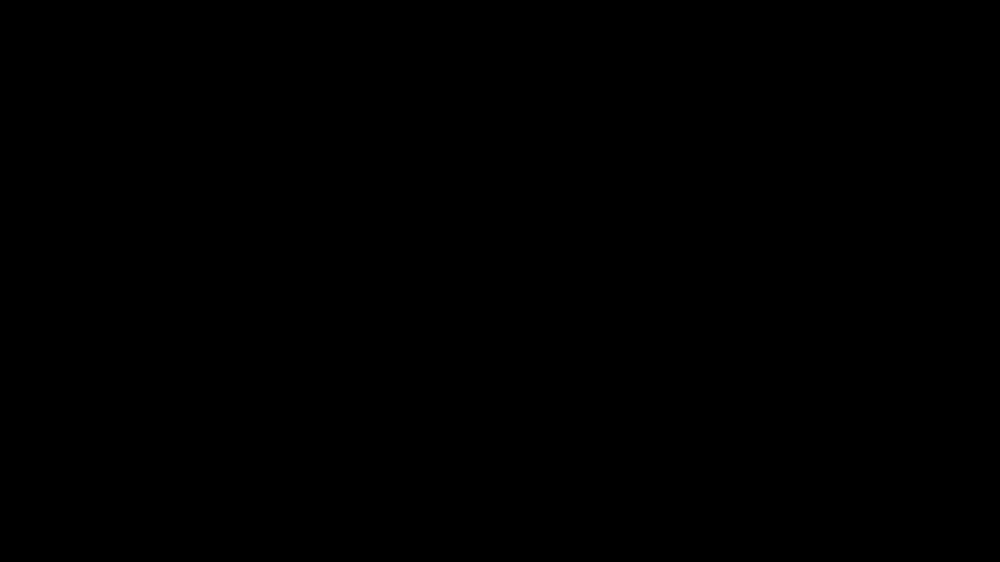
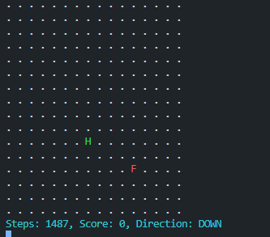

## 基于强化学习训练贪吃蛇

强化学习是 agent 在与 env 互动当中,为了达成 goal 而进行学习的过程

第一层: agent(玩家) env(环境) goal(目标)

第二层: state(状态) action(行动) reward(奖励)

第三层: policy(策略) value(价值)

### 未开始训练时的游戏

`uv run snake/run.py`



#### 第一次训练的模型

只会上下走,维持不死

```python
# 当前奖励算法
if self.game_over:
    reward = -1  # 撞墙或撞自己，负奖励
elif self.snake[0] == self.food:
    reward = 1  # 吃到食物，正奖励
else:
    reward = -0.01  # 每步小负奖励，鼓励快速吃到食物
return self.get_state(), reward, self.game_over
```



### install

```shell
uv init
uv venv
source .venv/bin/activate
uv pip install .

# win
Set-ExecutionPolicy -ExecutionPolicy RemoteSigned -Scope Process
.venv/Scripts/activate
```

### TODO List

- [ ] 多GPU训练,多GPU推理
- [ ] 适配lighting训练
- [ ] 给出的模型可以蛇占全屏
- [ ] 适配多种长宽的屏幕
- [ ] 提出新的的奖励算法
- [ ] 给出文章和视频教学
- [ ] 看看PPO和GRPO
- [ ] 复刻五子棋与XXOO
- [ ] 复刻象棋
