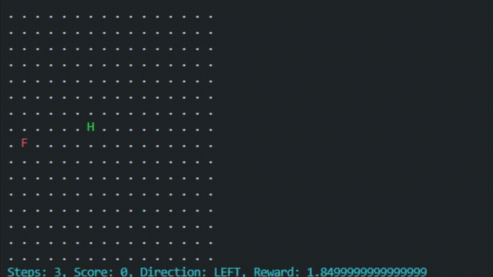

## 基于强化学习训练贪吃蛇

强化学习是 agent 在与 env 互动当中,为了达成 goal 而进行学习的过程

第一层: agent(玩家) env(环境) goal(目标)

第二层: state(状态) action(行动) reward(奖励)

第三层: policy(策略) value(价值)

### 未开始训练时的游戏

`uv run snake/run.py`


#### 第一次模型

似乎不太想吃食物,不断远离食物,靠近食物

```python
奖励函数的设计如下：

游戏结束：奖励为 - 5 - 10 / (1 + 0.1 * (len(self.snake) - 1))，惩罚与蛇长度反比。
吃到食物：奖励为 5 + 0.3 * (len(self.snake) - 1)，奖励与蛇长度正比。
未吃到食物：
接近食物：+0.3
远离食物：-0.3
距离不变：-0.1
远离蛇尾：奖励 +0.01 * tail_distance。
```


#### 第二次模型

很容易死+偶尔转圈圈,但是好歹跑起来了

```python
if self.game_over:
    # 简化游戏结束的惩罚，设置为固定值
    reward = -10
else:
    if self.snake[0] == self.food:
        # 显著增加吃到食物的奖励
        reward = 20
        self.prev_distance = None  # 重置距离，因为食物位置会改变
    else:
        # 调整接近或远离食物的奖励权重
        current_distance = self._calculate_distance(self.snake[0], self.food)
        if self.prev_distance is not None:
            if current_distance < self.prev_distance:
                reward += 1.0  # 增加接近食物的奖励
            elif current_distance > self.prev_distance:
                reward -= 0.8  # 增加远离食物的惩罚
            else:
                reward -= 0.2  # 距离不变时的惩罚
                self.prev_distance = current_distance
        # 防止无限循环
if self.current_steps >= self.max_steps:
    self.game_over = True
    reward = -20
```



#### 第三次模型

随着训练次数,可以看见,平均奖励在增加,20000次一个小时

似乎还是哪儿有问题,难不成一直增加训练时间,我觉得还是收敛太慢了,需要修改`DQN`这个类

还是没搞懂,到底是哪儿影响了收敛速度


```
. . . . . . . . . . . . . . . . 
. . . . . . . . . . . . . . . . 
. . . . . . . . . . . . . . . . 
. . . . . . . . . . . . . . . . 
. . . . . . . . . . . . . . . . 
. . . . . . . . . . . . . . . . 
. . . . . . . . . . . . . . . . 
. . . . . . . . . . . . . . . . 
. . . . . . . . . . . . . . . . 
. . . . . . . . . . . . . . . . 
. . . . . . S S S S S S S . . . 
S S S S S S . . . . . . S S S . 
S S . . . S . . . . . . . . S . 
. S S S S H . . . . F . . S S . 
. . . . S S S S S S S S S S . . 
. . . . . . . . . . . . . . . . 
Steps: 531, Score: 36, Direction: DOWN, Reward: 1094.04

. . . . . . . . . . . . . . . . 
. . F . . . . . . . . . . . . . 
. . . . . . . . . . . . . . . . 
. . . . . . . . . . . . . . . . 
. . . . . . S S S S S S . . . . 
. . . . . . . . . . . S . . . . 
. . . . . . . . . . . S S . . . 
. . . . . . . . . . . . S . . . 
. S S . . . . . . . . . S . . . 
. S S S . . . . . . . . S . . . 
. S . S S . . . . . . . S . . . 
. S . . S . . . . . . . S . . . 
. S . . S . . . . . . . S . . . 
. S . . S . . . . . . . S . . . 
. S . . S . . . . . . . S . . . 
. S S H S S S S S S S S S . . . 
Steps: 911, Score: 44, Direction: RIGHT, Reward: 1411.78
```

### install

```shell
uv init
uv venv
source .venv/bin/activate
uv pip install .

# win
Set-ExecutionPolicy -ExecutionPolicy RemoteSigned -Scope Process
.venv/Scripts/activate
```

### structure
```text
RLSnake_Try/
|
├── infer.py
├── train.py
├── rl_snake/
│   ├── DQN.py
│   ├── ReplayBuffer.py
│   └── SnakeEnv.py
└── snake/
    ├── SnakeGameMain.py
    └── run.py
```

### TODO List

- [ ] 游戏通关
- [ ] 适配多种长宽的屏幕
- [ ] 提出新的的奖励算法
- [ ] 给出文章和视频教学
- [ ] 看看PPO和GRPO
- [ ] 复刻五子棋与XXOO
- [ ] 复刻象棋
